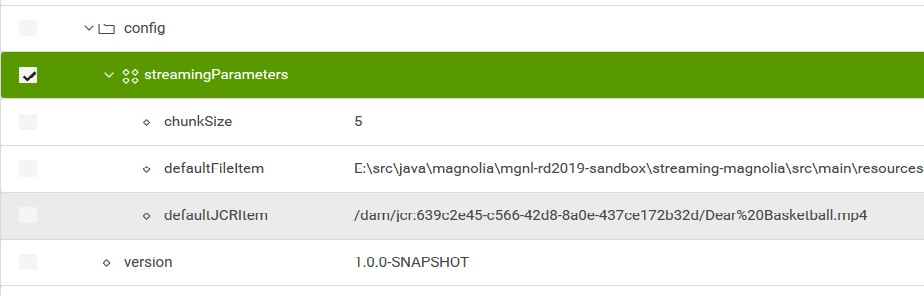
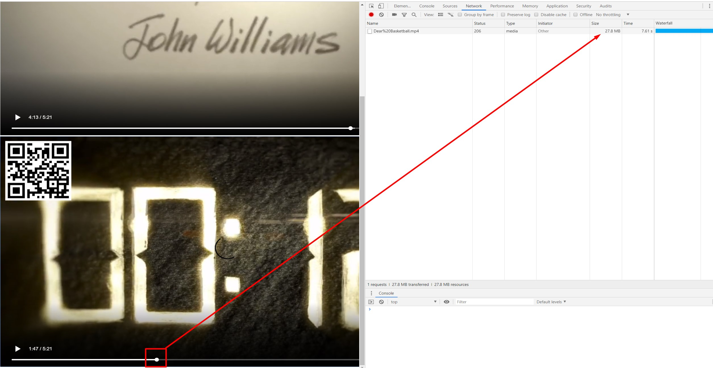
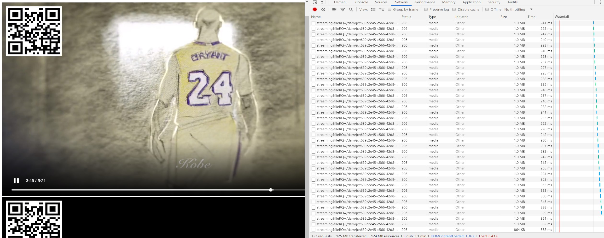

# Magnolia Streaming - Retos digitales 2019  

This project is part of the competition Retos Digitales 2019 from Magnolia International. 
**Area 4: "Próxima funcionalidad estrella de Magnolia"** or next incoming Magnolia functionality

> New feature: Implements progressive download into Magnolia. 

> It's a Magnolia low level project integrating Spring MVC 5 as a filter chain into the Magnolia context, allowing streaming DAM Assets with header-range control, splitting files in customizable mb chunks (by default 5MB), generating a professional environment for video streaming.

Note: Uncomment Web flux dependency in streaming-magnolia module pom to activate Spring WebFlux with MVC into the Filter Chain!.

Based on Magnolia 6.0

## Features
> Magnolia has grown so much that now is really hard achieving new features. The product is mature enough to solve most of any company problems. Within the DAM Module you can serve multimedia files including AWS S3 storage files via a plugin. 

> *Problem*: When serving a video file with Magnolia it will load all the file into the request which is a HUGE problem on rendering context. The Magnolia Streaming module allows you to integrate big videos without taking care about it's size. The file gets open in a non blocking way (JCR works with LazyInputStream) and only is returned the amount of mandatory and requested information. After that, it releases the stream which causes a better server load control.   

- Adds Spring MVC 5 support in the Magnolia filter chain in a professional way
- Registers RegionResourceMessageConverter to change behaviour for big files
- Provides basic video components for video streaming
- Improves video performance for partial file streaming
- Can improve to the next level with a good cache configuration
- Includes a basic content app for managing video asset provided by rest api
- (Optional) Includes a configuration in a light module for basic based video component
- (Optional) Includes a ReactJS project rendering your own streaming portal

## Usage
> Step 1 - Just compile the project and execute it as a magnolia bundle. 

- Download the full project with maven and java 1.8 already installed in your computer
- Deploy the generated war in your server
- Works as a bundle. Copy the module into your project directly if you need it.
- Create a video component and check how it reaches com.albertosoto.mgnl.rd2019.spring.controller.StreamingController.regionStreaming
- Change your streaming chunk size at /modules/streaming-magnolia/config/streamingParameters
- If Asset is not found will send the default values (set up your default corporate videos)
- Set server settings for your custom install at mgnl-bootstrap/streaming-magnolia/config.modules.streaming-magnolia.config.streamingParameters.yaml

> The next steps are optional!

> Step 2 - Use the provided component or adapt the video component to your needs. 

- You have a light-module called "light-streaming" with a very basic "Streaming Video Component"
- Create a page an add the component to it with a DAM asset
- Modify it as you need. The component is only an example

> Step 3 - Configure your media browser (optional)

- Open the content app for video located at Edit apps > Streaming
- Upload your videos to DAM module and configure your portal

> Step 4 - Launch the react application (optional)

- This project set up roles to consume the rest api service via a react application
- Go to /react-module and type "npm install". Will install dependencies.
- Point react-module/src/constants.js to your magnolia instance
- Enable CORS on your browser
- Go to /react-module and type "npm start" task
- Browse your content and start watching films! 

## Behaviour

> Download profile of conventional streaming from DAMModule

You can see how the file is downloaded at once, and it doesn't allow partial content rendering
Content rendering is trough a blocking response and it does not allow changing easy the cursor or video timing

> Download profile of conventional streaming from DAMModule

Here you are the final behaviour. Time response is much faster and the browser comunicates with the server generating small requests of 1M.
The browser is not block, and changing from one time to another is much faster. 

## Components provided

> Project target: Rendering engine

- The spring 5 rendering controller with header control for asset streaming has been a very tough target. It has been one of the most challenging targets I have ever done.
- URI: {magnolia-server}/.spring/streaming?fileRQ=${damAssetURI}

> Light module: A controller with demo files is included 
- Although the main concept of the project is not providing webComponents there are base components as an example to work with it.
- Path : /light-modules/light-streaming

> Content app: A content app is created to manage your video assets

- It will help you check faster how it works!
- You can consume data through rest api
- Path: Edit apps > Streaming 

> React app: Popcorn time is on magnolia

- Compile the react app pointing it to your magnolia instance
- Path: /react-module/dist/streaming-react.html

> Magnolia CORS filter and anonymous user roles  

If you will not need the rest point PLEASE **delete the following files**:

-   mgnl-bootstrap/streaming-magnolia/userroles.anonymous.xml
-  mgnl-bootstrap/streaming-magnolia/config.server.filters.addCORSHeaders.xml 

## Technical info

> This information is low level technical info. Go for a coffee and read it carefully

Adds progressive download support to magnolia via Spring Framework 5
  
Low level explanation: Magnolia DAM Module renders via DamDownloadServlet an Stream from an Asset in JCR

- The problem is that the stream gets open in a blocking way and sent through the request.
- In the inner side, the asset has an LazyInputStream, which means that is does not get open until it really is on the stream, which causes that the stream gets open several times in a blocking way, creating a possible bottle neck for users if the server load gets high.
- On the client side, the stream is open all time, and in every point the user picks another time in the html5 video the video starts loading again. That is really painful for the server.

This implementation focus on the browser request, reading the bytes that it's requesting httpHeader, and sends only the desired information, which causes a must better performance. On the other hand, the stream gets free earlier, wich makes the server faster to other users and it works in a non blocking way.

Moreover, the domLoad time drops, which is a better SEO positioning and score finally.

As the Asset stream is a LazyInputStream, Spring 5 documentation explains the following at their docs:

- "LazyInputStream should only be used if no other specific Resource implementation is applicable. In particular, prefer ByteArrayResource or any of the file-based Resource implementations where possible. In contrast to other Resource implementations, this is a descriptor for an already opened resource. Therefore returning true from isOpen(). Do not use an InputStreamResource if you need to keep the resource descriptor somewhere, or if you need to read from a stream multiple times."

- "Last but not the least, implementations of ClientHttpRequestFactory has a boolean bufferRequestBody that you can, and should, set to false if you are uploading a large stream. Otherwise, you know, OutOfMemoryError. As of this writing, SimpleClientHttpRequestFactory (JDK client) and HttpComponentsClientHttpRequestFactory (Apache HTTP client) support this feature, but not Ok Http3ClientHttpRequestFactory. Again, design oversight."   
  
## Information on Magnolia CMS
This directory is an extended version of a Magnolia 'blossom module' delivered as a full project.
https://docs.magnolia-cms.com
You can use Blossom archetype from Magnolia International to start creating your own template!

## License

MIT

## Contributors

- Magnolia CMS, https://magnolia-cms.com
- Alberto Soto Fernandez, https://github.com/albertoSoto/